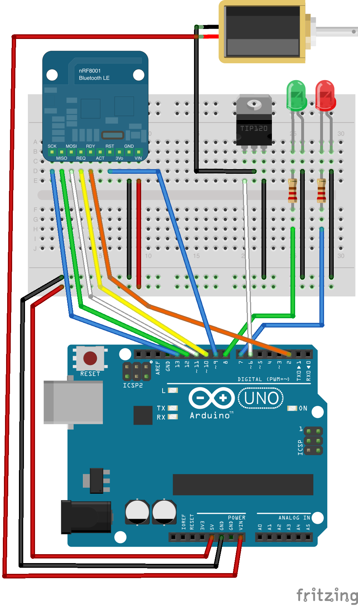
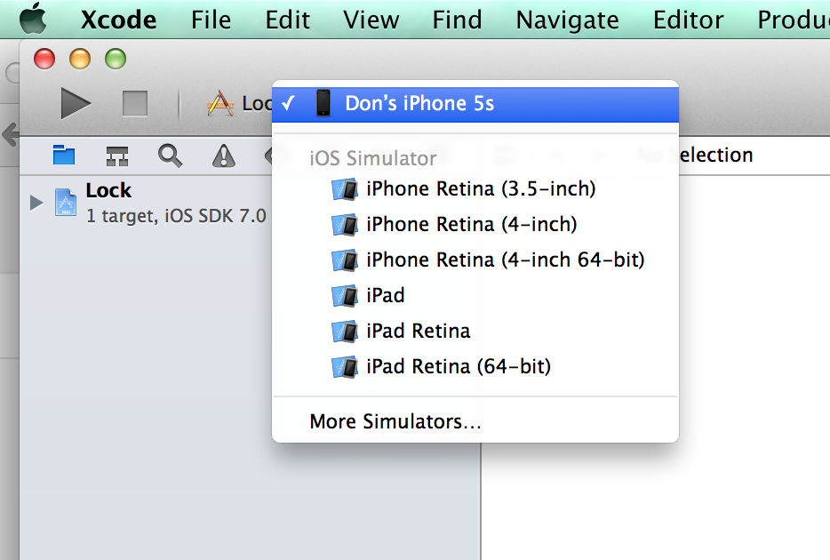

# Bluetooth Lock

## Arduino

## Cordova (aka PhoneGap)

### Setup

 * Xcode 5.0
 * Cordova 3.4.0

Cordova 3.4.0 won't work with Xcode 5.1, unless you apply patches. Please use Xcode 5.0.
 
Install NodeJS with `brew install` or download from http://nodejs.org.

Install Cordova using NPM, which comes with NodeJS.

    $ npm install -g cordova
  
### Building

The project from git contains only the Cordova code. The iOS platform and BluetoothSerial plugin need to be installed into the project before running.

    $ cd cordova
    $ cordova platform add ios
    $ cordova plugin add https://github.com/don/BluetoothSerial
    $ cordova prepare
    $ open platforms/ios/Lock.xcodeproj
  
Plug in your iPhone.
Choose the target device in Xcode.
)
Build and deploy through Xcode.

### Making changes

You can modify the application by editing the files in `$PROJECT_HOME/cordova/www`.

Make sure you run `cordova prepare` before redeploying the app through Xcode.
